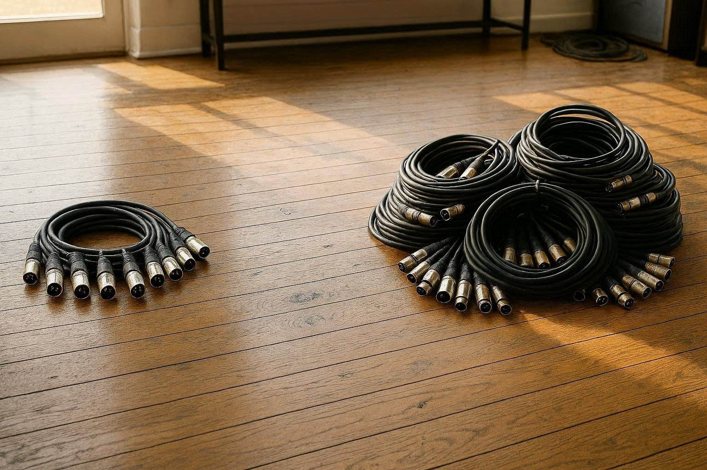

# sc_select 10 ⇒ 100 Audio Devices Patch

## Background
For one reason or another the original sc_select.mmw utility was limited to 
only offering the choice of ten input and output devices.  

This patch updates the binary to allow up to one hundered audio devices.  I 
thought that would be enough.  :-) 

## Download
The [patched file](sc_select_patched.zip) is availalbe for download.

I have retained the [original](sc_select_original.zip) along with the patch
file and a script to apply the patch just in case it needs to be updated 
down the track.

## Postscript
It's hard, sitting in 2026, to know what the original author's motivation for 
limiting the number of audio devices to ten was.  I can only venture that the 
thought of hitting that limit was inconceivable.  Yet here we are with
our virtual audio cables, DAWs and what-not.  Perhaps in the future another 
developer will ponder why it was that this updated version imposed a limit of 
one hundered.  

So, dear future reader, it is to me, at this point in time, inconceivable
that you would have more than one hundered interfaces, but if you do, I hope 
you'll find this repo to more easily to patch the file to your unfathomable 
requirements ;-)