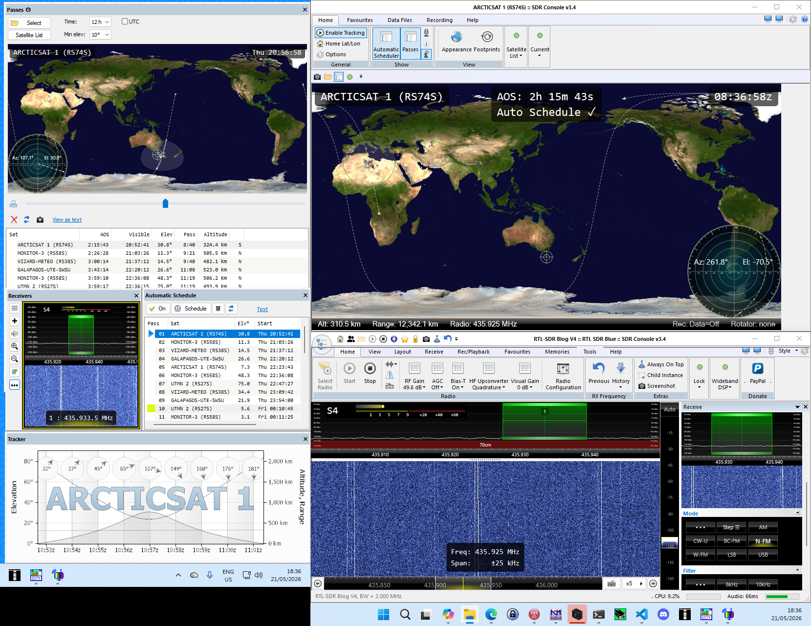

## Required windows
The script in it's current state requires the following SDR-Console windows
to allow it to capture sections for the image overlay.  They should be
roughly the same size, with any change in window dimentions requiring updates
to [runner.ps1](runner.ps1) to ensure the correct portion is captured.
- **Passes**: Very dependent on window size
- **Receivers**: Should be size independent, as long as the waterfall is at least
100x90 (W x H)
- **Tracker**: Not super dependent, but will scale to be the same width as the 
captured image.

## Considerations

### Passes window
While the main window could be used, it has two shortcomings:
1. The window name can't be easily distinguished from the main 
SDR Console window, so you need to address a child window 
(e.g. Automatic Schedule) then get the parent.
2. When the computer is locked or the screen off, the map dissapears, and
so isn't captured.

The only downside of using the Passes window is that it doens't capture the 
satellite position at the end of the pass; it's always at zenith.
